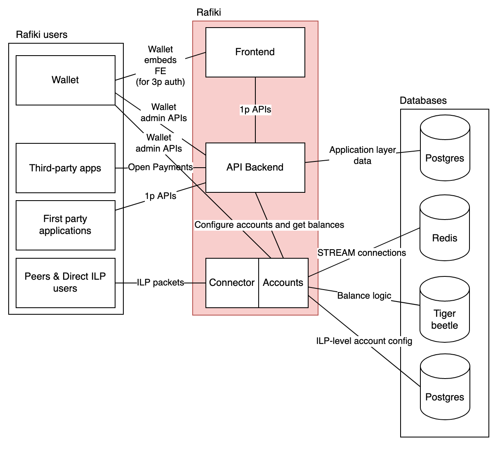

# Rafiki Architecture

Rafiki is a collection of four services that are run together; each one can be scaled horizontally. These applications are

- [`backend`](../packages/backend): The main service, handling business logic and external communication.
- [`auth`](../packages/auth): The service used for Grant Authorization and authentication. Rafiki provides this as a reference implementation, with the understanding that Rafiki operators can use and deploy their own service for authorization and authentication.
- [`rates`](../packages/rates): The service is used to calculate exchange rates and fees for the quoting mechanism. This is an example service provided for testing, and Rafiki operators are expected to deploy their own business logic for applying fees.
- [`frontend`](../packages/frontend): Internal admin interface, not yet developed. Eventually, Rafiki operators will be able to manage their Rafiki instance with it.

These services rely on four databases:

- A postgres database used by the `backend`
- A separate postgres database used by `auth`.
- [Tigerbeetle](https://github.com/coilhq/tigerbeetle) used by `backend` for accounting balances at the ILP layer.
- Redis used by `backend` as a cache to share STREAM connection details across processes.

## Backend

The `backend` service has four responsibilities:

- Expose REST [Open Payments API](https://docs.openpayments.guide/reference) endpoints for public clients to perform account management tasks.
- Expose an internal GraphQL Admin API for service operators to manage accounts and application settings like peering relationships.
- Expose an ILP connector to send and receive STREAM packets with peers.
- Business logic to manage accounts and track balances.

The `backend`'s ILP functionality includes:

- Accepting ILP packets over an HTTP interface and authenticating them against ILP account credentials
- Routing ILP packets to the correct destination account
- Converting currencies
- Sending out ILP packets over HTTP for destinations that are not local
- Fulfilling packets with an internal STREAM server

## Auth

The `auth` service performs authorization and authentication of incoming requests. For requests from entities that have accounts within the local instance of Rafiki, the `auth` service uses data stored in the auth postgres database. For requests from clients registered with other instances of Rafiki, the auth service resolves the client's public key from its source and uses it to authenticate and authorize the request.

## Rates

The `rates` service in this repo is a placeholder service for providing exchange rates between assets. It is called by the `backend` when
creating quotes. It is intended for development use while working on Rafiki; anyone deploying Rafiki to production should implement a
rates service appropriate to their business.

## Frontend

The frontend will host the internal admin interface. The current application is a placeholder.
