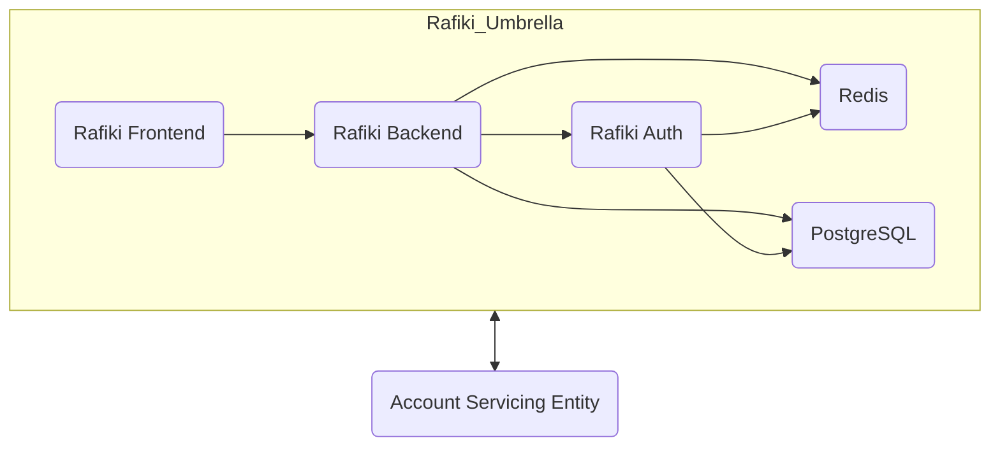

# Rafiki Umbrella Helm Chart

Essentially this chart is a wrapper around the individual Rafiki service charts, which are defined in the `https://interledger.github.io/charts/interledger` repository. It is not intended to be used for production deployments, but rather to give a integrator a quick way to get started with Rafiki in a development or testing environment.

> 📘 For details on Rafiki’s components and architecture, refer to the official [Rafiki documentation](https://github.com/interledger/rafiki).

This example defines an *umbrella Helm chart* to install the following components:

* **Rafiki Auth**
* **Rafiki Backend**
* **Rafiki Frontend**
* **PostgreSQL** (database)
* **Redis** (application cache)

### System Diagram



Umbrella charts allow bundling and deploying multiple Helm charts as a single application. This chart installs all Rafiki services along with their supporting infrastructure (PostgreSQL and Redis). 

⚠️ **Note:** This chart does *not* include an Identity Provider (IdP). That is considered part of the ASE (Account Servicing Entity) and must be handled separately.

---
# Prerequisites

This guide assumes you have:

* A Kubernetes cluster running somewhere you can access
* `kubectl` and `helm` installed on your local machine. Ensure that kubectl is configured to connect to your Kubernetes cluster.
* Some understanding of how Kubernetes and Helm works

---
# Install the Rafiki Umbrella Helm Chart

This repository contains a sample `values.yaml` for configuring the umbrella chart.

## 1. Update the `values.yaml`

🔧 Replace all occurrences of `YOUR_INGRESS_HOST` in `values.yaml` with the actual IP address or domain unto which you will be accessing the application.
🔧 Replace all occurances of `YOUR_ACCOUNT_SERVICING_ENTITY` with appropriate values pointing to your account servicing entity
🔧 Be sure to set the `ingressClassName` to match your ingress controller (e.g., `traefik`, `nginx`, etc.).
- See `templates/ingress.yaml` on how the ingress is configured.


## 2. Deploy the Chart

We recommend that you create a dedicated namespace for the Rafiki deployment. In the example below we will be using the namespace `rafiki`.

```bash
# Creates a new namespace called 'rafiki'
kubectl create namespace rafiki

# Add the required Helm repositories
helm repo add bitnamicharts oci://registry-1.docker.io/bitnamicharts
helm repo add interledger-charts https://interledger.github.io/charts/interledger

# Instruct helm to download the chart dependencies
helm dependency update .

# Install the chart from the current folder and gives the release the name 'ru'
# for "Rafiki Umbrella"
helm install -n rafiki ru .
```

This may take a few minutes while it pulls all the container images and initializes PostgreSQL and Redis.

## Verify deployment:

```bash
kubectl get pods -n rafiki
```

Example output:

```
NAME                               READY   STATUS    RESTARTS   AGE
rafiki-auth-...                    1/1     Running   0          1m
rafiki-backend-...                 1/1     Running   0          1m
rafiki-frontend-...                1/1     Running   0          1m
rafiki-postgresql-0                1/1     Running   0          1m
rafiki-redis-master-0              1/1     Running   0          1m
```

Check ingress:

```bash
kubectl -n rafiki get ingress
```

Example:

```
NAME                 CLASS     HOSTS   ADDRESS           PORTS   AGE
entrypoint-ingress   traefik   *       YOUR_INGRESS_HOST   80      3m
```

🧭 Open `http://YOUR_INGRESS_HOST` in your browser to access the Rafiki Frontend.


Note that the provided ingress exposes most of the services to your desktop through the 
provided ingress controller using url paths. 
```sh
$ kubectl -n rafiki get ingress -o yaml
```
Output
```yaml
apiVersion: v1
items:
- apiVersion: networking.k8s.io/v1
  kind: Ingress
  metadata:
    annotations:
      meta.helm.sh/release-name: ru
      meta.helm.sh/release-namespace: rafiki
    generation: 1
    labels:
      app.kubernetes.io/managed-by: Helm
    name: entrypoint-ingress
    namespace: rafiki
    resourceVersion: "12242"
    uid: f65215ce-7f2e-4f57-806c-250c096142f8
  spec:
    ingressClassName: traefik
    rules:
    - http:
        paths:
        - backend:
            service:
              name: rafiki-frontend-service
              port:
                number: 3010
          path: /
          pathType: Prefix
        - backend:
            service:
              name: rafiki-auth-service
              port:
                number: 3006
          path: /auth-server
          pathType: Prefix
        - backend:
            service:
              name: rafiki-backend-service
              port:
                number: 3000
          path: /open-payments
          pathType: Prefix
  status:
    loadBalancer:
      ingress:
      - ip: YOUR_INGRESS_HOST
kind: List
metadata:
  resourceVersion: ""
```
Feel free to make changes to the template/ingress.yaml file to customize the ingress rules.

After making changes you can redeploy the chart with:
```bash
helm upgrade -n rafiki --force ru .
```

---
# Troubleshooting

View logs with `kubectl logs` to diagnose issues.

If you want a clean slate you can just delete the rafiki namespace and start again.

```bash
# Gracefully uninstall the chart
helm uninstall -n rafiki ru
# Delete the namespaces to ensure the persistent volumes are cleaned up
kubectl delete namespace rafiki
# Recreate the namespace
kubectl create namespace rafiki
```


