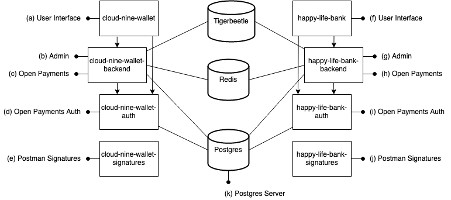

# Local Playground

This environment will set up an playground where you can use the Rafiki Admin APIs and the Open Payments APIs.

Prerequisites:

- [Rafiki local environment setup](../../README.md#environment-setup)
- [docker](https://docs.docker.com/get-docker/)
- [compose plugin](https://docs.docker.com/compose/install/compose-plugin/)
- [postman](https://www.postman.com/downloads/)

The following should be run from the root of the project.

```
// If you have spun up this environment before then run
pnpm localenv:stop && pnpm localenv:dbvolumes:remove

// Start the local environment
pnpm localenv:start

// tear down
pnpm localenv:stop

// delete database volumes (containers must be removed first with e.g. pnpm localenv:stop)
pnpm localenv:dbvolumes:remove
```

If you want to use Postgres as the accounting database instead of Tigerbeetle, you can append `psql` to the `localenv:` commands:

```
pnpm localenv:psql:start
pnpm localenv:psql:stop
pnpm localenv:psql:dbvolumes:remove
```

The local environment consists of a primary Rafiki instance and a secondary Rafiki instance, each with
its own docker compose files ([Cloud Nine Wallet](./cloud-nine-wallet/docker-compose.yml), [Happy Life Bank](./happy-life-bank/docker-compose.yml)).
The primary Cloud Nine Wallet docker compose file (`./cloud-nine-wallet/docker-compose.yml`) includes the main Rafiki services `backend` and `auth`, as well
as the required data stores tigerbeetle (if enabled), redis, and postgres, so it can be run on its own. Furthermore,
both include the `local-signature-utils` signature generation app for Postman.
The secondary Happy Life Bank docker compose file (`./happy-life-bank/docker-compose.yml`) includes only the Rafiki services, not the data stores. It uses the
data stores created by the primary Rafiki instance so it can't be run by itself.
The `pnpm localenv:start` command starts both the primary instance and the secondary.

## Environment overview



#### Cloud Nine Wallet

(a) User Interface - accessible at http://localhost:3030

(b) Admin API - accessible at http://localhost:3001/graphql

(c) Open Payments API - accessible at http://localhost:3000

(d) Open Payments Auth API - accessible at http://localhost:3006

(e) Postman Signature Service - accessible at http://localhost:3040

(f) Rafiki Admin - accessible at http://localhost:3010

#### Happy Life Bank

(g) User Interface - accessible at http://localhost:3031

(h) Admin API - accessible at http://localhost:4001/graphql

(i) Open Payments API - accessible at http://localhost:4000

(j) Open Payments Auth API - accessible at http://localhost:4006

(k) Postman Signature Service - accessible at http://localhost:3041

(l) Rafiki Admin - accessible at http://localhost:4010

#### Database

(m) Postgres Server - accessible at http://localhost:5432
