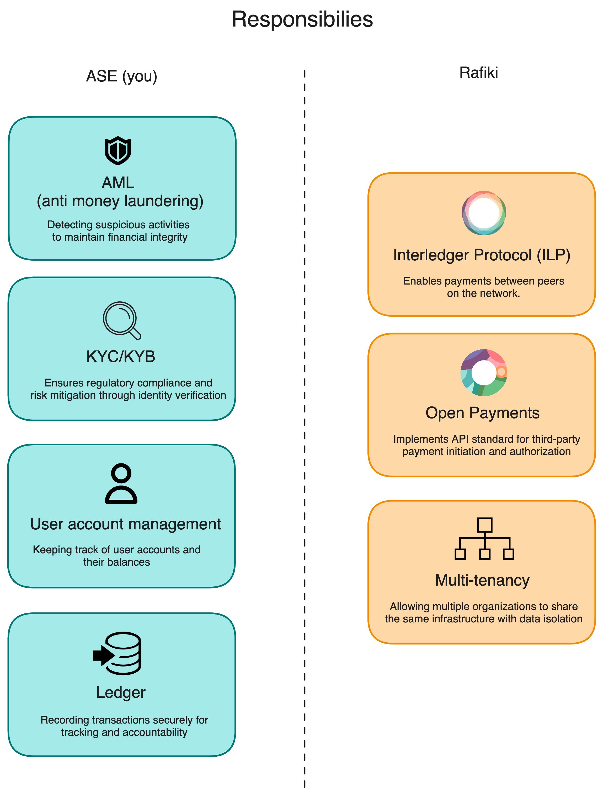
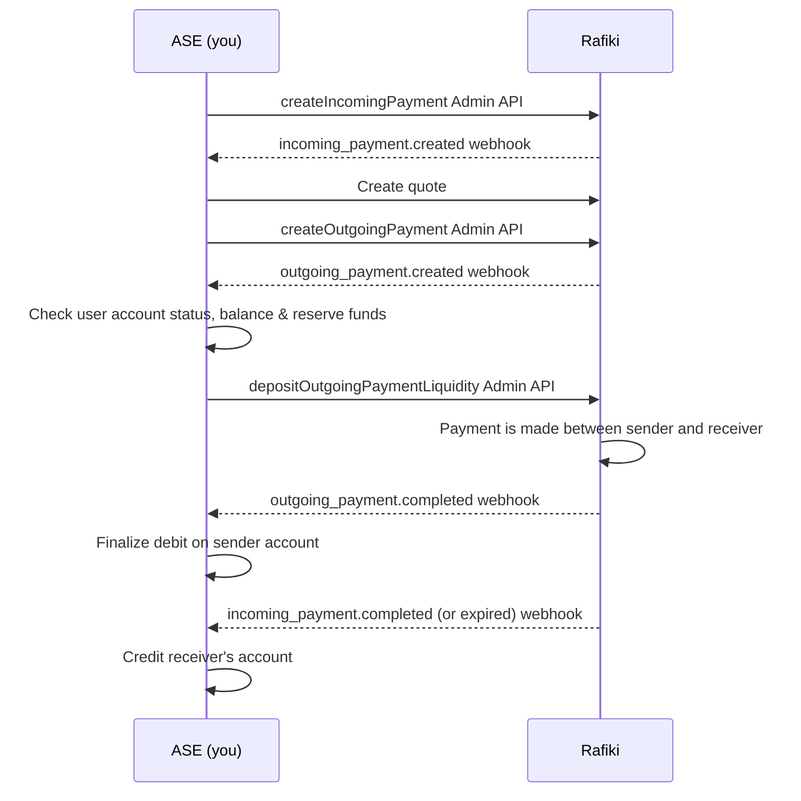

# Rafiki integrator developer guide

## ASE and Rafiki responsibilities

## Open Payments and ILP

### Open Payments API
Open Payments is an API standard for allowing **third-party clients** to initiate payments between wallet addresses.

#### Use cases
- eCommerce payments
- Peer to peer payments (e.g. remittances)
- Recurring payments (e.g. subscriptions)

### ILP (Interledger Protocol)
A protocol for transferring payments (through packets).
If the Open Payments API is responsible for payment authorization, then ILP is **how** the payments actually happen. 

### Basic concepts
#### Wallet addresses
A wallet address is a sharable identifier (URL) linked to an underlying user account at an ASE, and accessible via the Open Payments API standard.

#### Assets
Assets represent monetary values, for example, country currencies. Each asset is made up of a code, and a scale to represent the decimal units. For example, US dollars can be deliniated as code: `USD`, with scale `2`, where value `1000` represents `$10.00`.

### Integrating Rafiki with your system
#### Components
Currently, Rafiki is made up of three software components:
- `backend`: hosts the Open Payments resource server, ILP connector, and the Admin API
- `auth`: hosts the Open Payments auth server
- `frontend`: UI to manage the Rafiki resources (wallet addresses, payments, assets, e.t.c.) through the Admin API.

#### Admin API
As an ASE, the main entrypoint into the Rafiki system will be through the Admin API. This is a GraphQL API.

### Integration steps
#### Creating assets
In order to begin your Rafiki integration, you need to load the assets you will support for your users. For example, if you will be supporting US dollars, you must create an USD asset in Rafiki [through the Admin UI or Admin API](https://rafiki.dev/integration/requirements/assets/).

#### Creating wallet addresses
After creating at least one asset, you can start [creating wallet addresses](https://rafiki.dev/integration/requirements/wallet-addresses/) under that asset. This wallet address must be linked to a user account in your sytem, and will be publicly accessible through the Open Payments API.

#### Making payments
Making payments consists of three parts:

##### 1. Creating an incoming payment
First, you will need to create an incoming payment for a recipient's wallet address using the [Admin API's `createIncomingPayment`](https://rafiki.dev/apis/graphql/backend/#mutation-createIncomingPayment). This will set up a resource to pay into.

##### 2. Creating a quote
Second, you will need to create a quote for a sender's wallet address using the [Admin API's `createQuote`](https://rafiki.dev/apis/graphql/backend/#mutation-createQuote). This will show how much it will cost the sender to deliver an amount to the receiver.

##### 3. Creating an outgoing payment
Third, you will create an outgoing payment for the sender's wallet address using the [Admin API's `createOutgoingPayment`](https://rafiki.dev/apis/graphql/backend/#mutation-createOutgoingPayment). This will be the operation to actually start the payment. At this point, you as the ASE will need to fund/approve the outgoing payment before it gets sent.

###### Webhook request handling
When operating Rafiki, you as the ASE will be notified about events that happen in the system, e.g. an incoming payment was created or expired. Some of these events are actionable, for example, the outgoing payment created event. When an outgoing payment is created, you as the ASE will need to:
1. Check that the user account (for the linked wallet address) is active
2. Check that the user account has enough balance to make the payment
3. Reserve funds on the user account
4. Notify Rafiki to approve the outgoing payment by calling the [`depositOutgoingPaymentLiquidity` API](https://rafiki.dev/apis/graphql/backend/#mutation-depositOutgoingPaymentLiquidity).

Once the outgoing payment has been approved/funded, Rafiki will make the payment between the sender and receiver.

5. If the payment in Rafiki is successful, you will receive an outgoing payment completed webhook. When this is received, you should finalize the debit of the sending user's account. 
6. You will also receive an incoming payment completed (or incoming payment expired) webhook. For these webhooks, you should credit the recepient's user account.

The [Rafiki documentation](https://rafiki.dev/integration/requirements/webhook-events/) describes all of the webhook events and how they should be handled.

> [!NOTE]  
> When Rafiki sends a webhook to the ASE, it expects a 200 response. Otherwise, it will keep retrying.

## FAQ
### What APIs are exposed publicly?
Open Payments endpoints + ILP connector. The Admin API must not be exposed externally.

### Can you make cross-currency payments?
In order to make cross-currency payments, you will need to create the corresponding assets, and [provide a way for Rafiki to fetch rates](https://rafiki.dev/integration/requirements/exchange-rates/).

