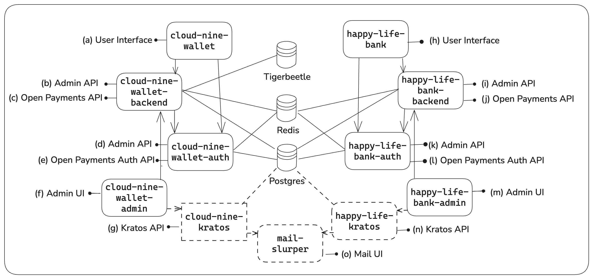
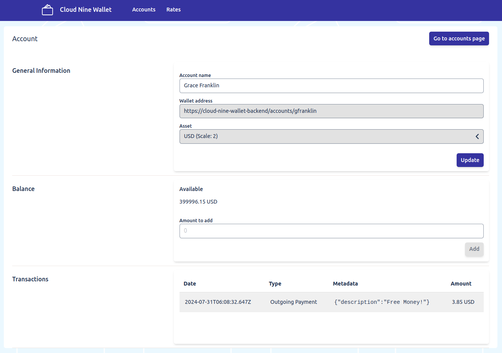

# Local Playground

The Local Playground, or `localenv` package, provides a suite of tools and packages to simulate an account servicing entity (ASE) deploying Rafiki. It enables developers to test Rafiki functionalities by exposing key services, such as:

- [SPSP](https://rafiki.dev/resources/glossary#simple-payment-setup-protocol-spsp) endpoint
- [Open Payments](https://rafiki.dev/overview/concepts/open-payments) APIs with its required [GNAP](https://rafiki.dev/resources/glossary#grant-negotiation-and-authorization-protocol-gnap) auth endpoints to request grants
- [STREAM](https://rafiki.dev/resources/glossary/#streaming-transport-for-the-real-time-exchange-of-assets-and-messages-stream) endpoint for receiving Interledger packets
- [Rafiki Admin](https://rafiki.dev/admin/admin-user-guide/) application to view and manage the Rafiki instance

## Included packages

| Package name                    | Services                                                                                         |
| ------------------------------- | ------------------------------------------------------------------------------------------------ |
| `backend`                       | SPSP, Open Payments APIs, GraphQL Admin APIs, STREAM endpoint                                    |
| `auth`                          | GNAP auth server                                                                                 |
| `mock-account-servicing-entity` | Mocks an [account servicing entity](https://rafiki.dev/overview/overview/)                       |
| `frontend`                      | Remix app to expose a UI for Rafiki admin management via interaction with the Backend Admin APIs |

## Dependencies

The Local Playground also includes the following databases:

- TigerBeetle or Postgres (accounting)
- Postgres (Open Payments resources, auth resources)
- Redis (STREAM details, auth sessions)

Two pre-configured docker-compose files are provided:

- [Cloud Nine Wallet](./cloud-nine-wallet/docker-compose.yml) A primary mock ASE with a full Rafiki backend
- [Happy Life Bank](./happy-life-bank/docker-compose.yml) A secondary ASE relying on the primary backend's data stores

These mock ASEs automatically peer and 2 to 3 user accounts are created on both of them.

# Setting up the Local Playground

## Prerequisites

- [Rafiki local environment setup](../README.md#environment-setup)
- [Docker](https://docs.docker.com/get-docker/) to run containerized services
- [Bruno](https://www.usebruno.com/downloads), an open source API client

## Installation steps

Start the Local Playground

```sh
pnpm localenv:compose up
```

To use Postgres instead of TigerBeetle as the accounting database, use:

```sh
pnpm localenv:compose:psql up
```

Optional authentication setup - to enable Rafiki Admin authentication locally, run:

```sh
pnpm localenv:compose:adminauth:up
```

## Shutting down

Stop running containers

```sh
pnpm localenv:compose down
```

Remove database volumes

```sh
pnpm localenv:compose down --volumes
```

Remove volumes and images

```sh
pnpm localenv:compose down --volumes --rmi all
```

# Environment components



## Cloud Nine Wallet

| Label | Component                | URL                             |
| ----- | ------------------------ | ------------------------------- |
| (a)   | User interface           | `http://localhost:3030`         |
| (b)   | Backend Admin API        | `http://localhost:3001/graphql` |
| (c)   | Open Payments API        | `http://localhost:3000`         |
| (d)   | Auth Admin API           | `http://localhost:3003/graphql` |
| (e)   | Open Payments Auth API   | `http://localhost:3006`         |
| (f)   | Rafiki Admin application | `http://localhost:3010`         |
| (g)   | \*_Kratos API_           | `http://localhost:4433`         |

## Happy Life Bank

| Label | Component                | URL                             |
| ----- | ------------------------ | ------------------------------- |
| (h)   | User interface           | `http://localhost:3031`         |
| (i)   | Backend Admin API        | `http://localhost:4001/graphql` |
| (j)   | Open Payments API        | `http://localhost:4000`         |
| (k)   | Auth Admin API           | `http://localhost:4003/graphql` |
| (l)   | Open Payments Auth API   | `http://localhost:4006`         |
| (m)   | Rafiki Admin application | `http://localhost:4010`         |
| (n)   | \*_Kratos API_           | `http://localhost:4432`         |

## Mail Slurper

| Label | Component   | URL                     |
| ----- | ----------- | ----------------------- |
| (o)   | \*_Mail UI_ | `http://localhost:4436` |

## Postgres Server

| Label | Component       | URL                     |
| ----- | --------------- | ----------------------- |
| N/A   | Postgres Server | `http://localhost:5432` |

> \*Note: In the Local Playground, Kratos and Mail Slurper are disabled by default.

## Exploring Accounts on Mock Account Servicing Entity

Navigate to `localhost:3030` to view the accounts on the Cloud Nine Wallet mock ASE.


The accounts of the Happy Life Bank mock ASE can be found on `localhost:3031`.

Select an Account Name to view account information, available balance, and a list of transactions.



# Debugging

Debuggers are exposed on the following ports:

| Service                   | IP and Port    |
| ------------------------- | -------------- |
| Cloud Nine Wallet Backend | 127.0.0.1:9229 |
| Cloud Nine Auth           | 127.0.0.1:9230 |
| Happy Life Bank Backend   | 127.0.0.1:9231 |
| Happy Life Bank Auth      | 127.0.0.1:9232 |

## Using a Chromium browser

1. Open `chrome://inspect`
2. Select **Configure** and add the following IPs and ports detailed above
3. Start the Docker containers
4. Select **Inspect** on the service to debug

## Using VS Code

Add this configuration to `.vscode/launch.json`:

```json
{
    "name": "Attach to docker (cloud-nine-backend)",
    "type": "node",
    "request": "attach",
    "port": 9229,
    "address": "localhost",
    "localRoot": "${workspaceFolder}",
    "remoteRoot": "/home/rafiki/",
    "restart": true
},
```

`localRoot` will vary depending on the location of `launch.json` relative to Rafiki's root directory.

For more ways to connect debuggers, see the Node docs for debugging: https://nodejs.org/en/learn/getting-started/debugging

## Interacting with the Local Playground

To learn how to interact with the Open Payments APIs, Admin APIs, and SPSP endpoints using tools like Bruno, consult the [Interacting with the Local Playground](https://rafiki.dev/integration/playground/overview/#interacting-with-the-local-playground) section in the Rafiki documentation.

# Rafiki Admin

Manage and view information about Rafiki instances via the Rafiki Admin application. Two instances are pre-configured:

- Cloud Nine Wallet: `http://localhost:3010`
- Happy Life Bank: `http://localhost:4010`

Authentication is disabled by default for ease of development, but it can be enabled locally by running:

```sh
pnpm localenv:compose:adminauth up
```

The Admin UI requires a valid API secret and tenant id to make requests to the Admin APIs, which must be submitted via a form on the frontend. For our convenience, we log a link on Mock Account Servicing Entity (MASE) start that can be used to access the Admin UI and set the credentials automatically. The credentials used pull from the MASE’s `SIGNATURE_SECRET` and `OPERATOR_TENANT_ID` environment variables.

```
cloud-nine-mock-ase-1  | Local Dev Setup:
cloud-nine-mock-ase-1  | Use this URL to access the frontend with operator tenant credentials:
cloud-nine-mock-ase-1  | http://localhost:3010/?tenantId=438fa74a-fa7d-4317-9ced-dde32ece1787&apiSecret=iyIgCprjb9uL8wFckR%2BpLEkJWMB7FJhgkvqhTQR%2F964%3D
```

For additional details on using the Rafiki Admin application within the Local Playground, including enabling authentication and managing users, see the [Local Playground Rafiki Admin](https://rafiki.dev/integration/playground/overview/#rafiki-admin) documentation.

# Reference

## Useful commands

| Description                                      | Command                                          |
| ------------------------------------------------ | ------------------------------------------------ |
| Show all merged config (with Tigerbeetle)        | `pnpm localenv:compose config`                   |
| Start (with Tigerbeetle)                         | `pnpm localenv:compose up`                       |
| Start (with Tigerbeetle) detached                | `pnpm localenv:compose up -d`                    |
| Down (with Tigerbeetle)                          | `pnpm localenv:compose down`                     |
| Down and kill volumes (with TigerBeetle)         | `pnpm localenv:compose down --volumes`           |
| Down, kill volumes (with Tigerbeetle) and images | `pnpm localenv:compose down --volumes --rmi all` |
| Show all merged config (with Postgresql)         | `pnpm localenv:compose:psql config`              |
| Build all the containers (with Tigerbeetle)      | `pnpm localenv:compose build`                    |
| Start (with Postgresql)                          | `pnpm localenv:compose:psql up`                  |
| Start (with Postgresql) detached                 | `pnpm localenv:compose:psql up -d`               |
| Down (with Postgresql)                           | `pnpm localenv:compose:psql down`                |
| Down (with Postgresql) and kill volumes          | `pnpm localenv:compose:psql down --volumes`      |
| Build all the containers (with Postgresql)       | `pnpm localenv:compose:psql build`               |

# Known Issues

## TigerBeetle container exits with code 137

There is a known [issue](https://docs.tigerbeetle.com/getting-started/with-docker-compose/#exited-with-code-137) when running TigerBeetle in Docker. The container exits without logs and simply shows error code 137. To fix this, increase the Docker memory limit.

If you are running the local playground in Docker on a Windows machine using WSL, you can increase the memory limit by [configuring](https://learn.microsoft.com/en-us/windows/wsl/wsl-config#example-wslconfig-file) your `.wslconfig` file.

# Further Documentation

For detailed instructions and advanced configurations, refer to the [Local Playground](https://rafiki.dev/integration/playground/overview/) documentation.
