# RAIO backend api

## Local Development

### Prerequisites

- [Docker](https://docs.docker.com/engine/install/) configured to [run as non-root user](https://docs.docker.com/engine/install/linux-postinstall/#manage-docker-as-a-non-root-user)
- If you are running MacOS, there is a known [issue](https://github.com/coilhq/tigerbeetle/issues/92). [TigerBeetle](https://github.com/coilhq/tigerbeetle) requires the privilege of using memlock functions, usually afforded by adding the linux capability (IPC_LOCK). Rafiki uses [testcontainers](https://github.com/testcontainers/testcontainers-node) which unfortunately provides no api to configure the containers for this use case. On MacOS, a workaround is update the defaults in `$HOME/.docker/daemon.json` with

  ```
  "default-ulimits": {
    "memlock": {
      "Hard": -1,
      "Name": "memlock",
      "Soft": -1
    }
  },
  ```

  and then restart docker.

- [`openapi`](https://github.com/interledger/rafiki/tree/main/packages/openapi):

```shell
pnpm --filter openapi build
```

### Testing

From the monorepo root directory:

```shell
pnpm --filter backend test
```

## Docker build

In order to build the docker container run the following command.

```shell
# from the root:
docker build -f packages/backend/Dockerfile -t rafiki-backend .
```

## Configuration

### Redis Connection

The connection can be configured by specifying the following environment variables.
The config is passed to `ioredis` - see https://github.com/luin/ioredis#tls-options.

| Variable                 | Description                                        | Default                  |
| ------------------------ | -------------------------------------------------- | ------------------------ |
| REDIS_URL                | Redis connection string.                           | "redis://127.0.0.1:6379" |
| REDIS_TLS_CA_FILE_PATH   | Path to CA certificate - overrides well-known CAs. | ""                       |
| REDIS_TLS_KEY_FILE_PATH  | Path to private key for client authentication.     | ""                       |
| REDIS_TLS_CERT_FILE_PATH | Path to certificate for client authentication.     | ""                       |

### Design

[Source ->](https://mermaid-js.github.io/mermaid-live-editor/edit#pako:eNp1U8tuwjAQ_JXIBxQk-AEOSI3ooaeCmlObHkyyDRaJTR37ECH-vbt-5AE0B3s9M-udteMrK1UFbMNqzS-nJN8VMsGvs0cPHHl5Bll59E2WqhWyTmOw530L0iw9_W5NrYiOwZw-WGUgdWNAXspSWWnSMM9R2mgMI9d1gHoaA7IH0CkNYZ1nX2kuatAZgGlg-T1J3CHngm6AfQFH-HCgYo_E3fU7aGKjpLlretC4hkngggEmy4TS_FAzWa-3EwNPyOB2bsMxrsyk9KN8hIO3J7uMnY12HeF9z04vWfjjxXnYYzHaXcTkpBG_VlTC9AkPmRNvKJ1cFclxwhukw_xXP_fhWMq-_5Eck2dP1PH-56W38X_xMD4AtmIt6JaLCt_KleCCmROaK9gGw4rrc8EKeUOdvVTcwCv2qTTbGG1hxbg16qOXZVx7zU5wfGVtBC9cfiqFyx_edHD7AzbEK6M)


### Chart Of Accounts

#### Definitions

| Definition | Description                                         |
| ---------- | --------------------------------------------------- |
| Account    | An account that may receive debit/credit transfers. |

#### Overview

| Number | User Story                                             |
| ------ | ------------------------------------------------------ |
| 1.     | Create liquidity account.                              |
| 2.     | Create settlement account.                             |
| 3.     | Transfer where source ledger match destination ledger. |

#### Events

`DR` - Debit account
`CR` - Credit account
`CA` - Create account

```
DR Participant A Settlement (C)                  30
      CR Participant A Liquidity                          30

DR Participant B Settlement (C)                 110
      CR Participant B Liquidity                         110
```

##### Transfer
