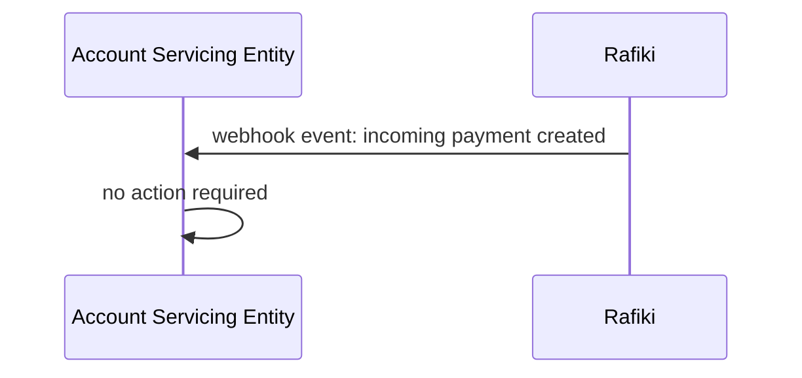
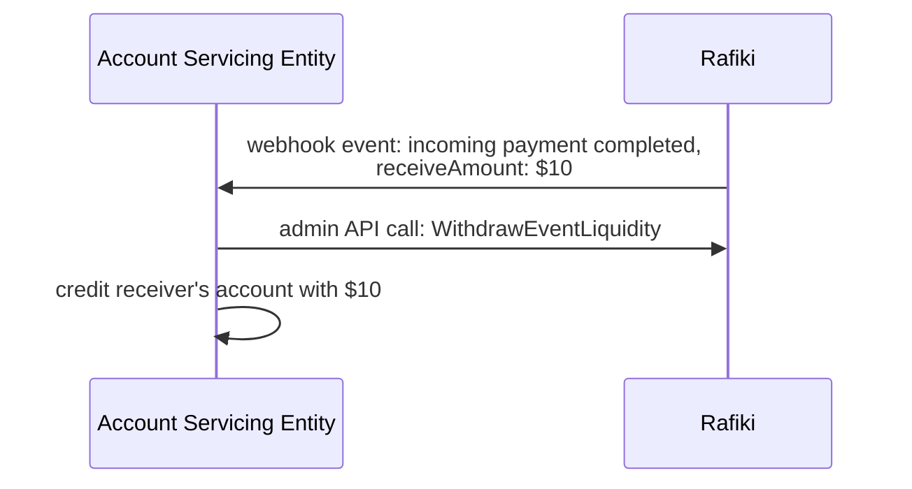
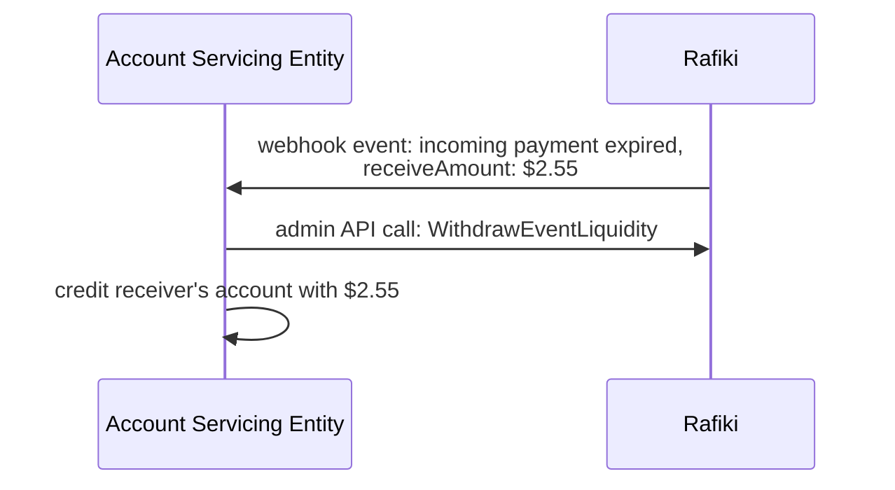
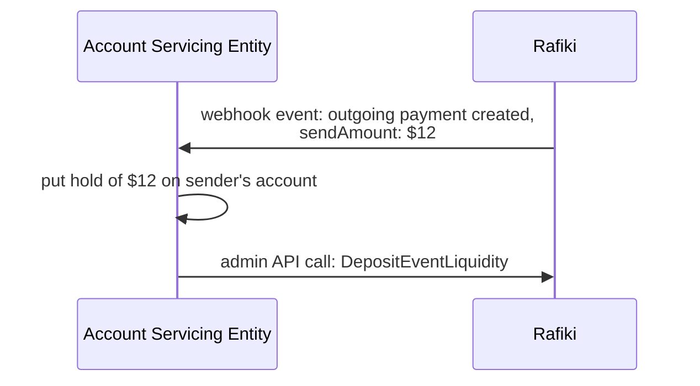
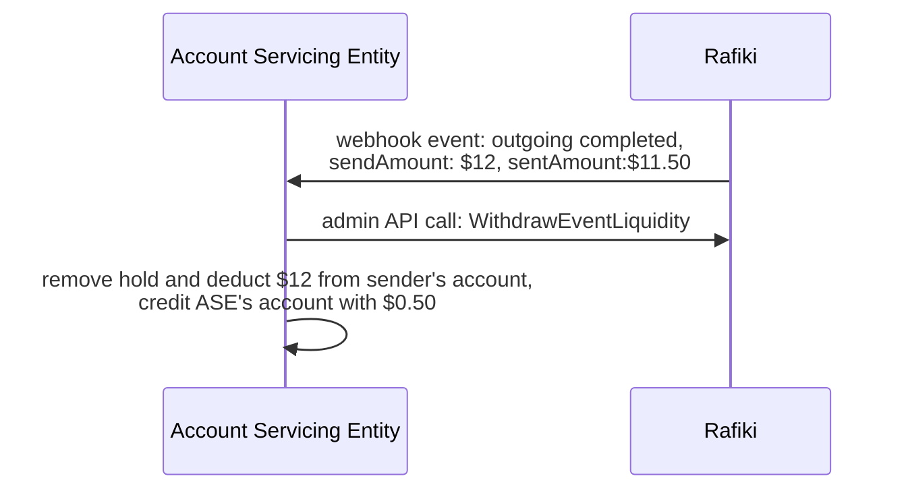
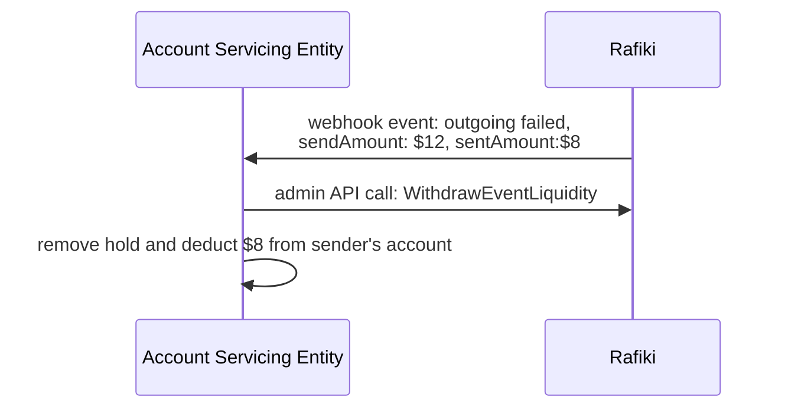
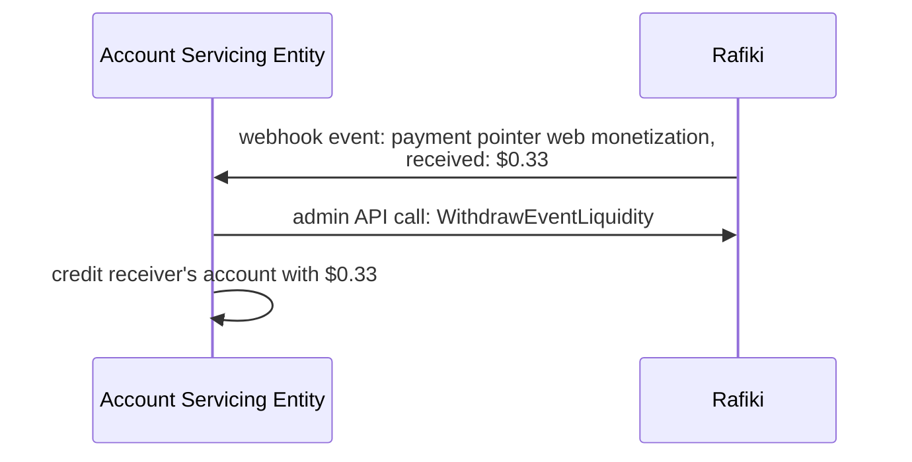

# Flow of funds

Rafiki communicates with the Account Servicing Entity over webhook events, which are defined in the _Getting Started_ section. Each event requires the Account Servicing Entity to either deposit or withdraw liquidity into or from Rafiki. This document will provide an example flow for each of the defines webhook events.

## `incoming_payment.created`

The `incoming_payment.created` event indicates that an incoming payment has been created. It has not yet received any funds so no action is required.

## `incoming_payment.completed`

The `incoming_payment.completed` event indicates that an incoming payment has been completed, either automatically or manually, and that any funds that have been received into this incoming payment should be withdrawn and credited to the recipient's account with the Account Servicing Entity.

Example: An incoming payment was completed and received $10.

## `incoming_payment.expired`

The `incoming_payment.expired` event indicates that an incoming payment has expired, and that any funds that have been received into this incoming payment should be withdrawn and credited to the recipient's account with the Account Servicing Entity.

Example: An incoming payment has expired and received $2.55.

## `outgoing_payment.created`

The `outgoing_payment.created` event indicates that an outgoing payment has been created and is awaiting liquidity. The Account Servicing Entity should put a hold on the sender's account and deposit the funds into Rafiki.

Example: An outgoing payment for $12 has been created.

## `outgoing_payment.completed`

The `outgoing_payment.completed` event indicates that an outgoing payment has successfully sent as many funds as possible to the receiver. The Account Servicing Entity should withdraw any access liquidity from that outgoing payment in Rafiki and book it as they see fit. One option would be to return it to the sender. The more likely scenario is that the access liquidity is considered as a fee and retained by the Account Servicing Entity. Furthermore, the Account Servicing Entity should remove the hold on the sender's account and debit it.

Example: An outgoing payment for $12 has completed. $11.50 were sent. The Account Servicing Entity keeps $0.50 as fees.

## `outgoing_payment.failed`

The `outgoing_payment.failed` event indicates that an outgoing payment has either partially or completely failed and a retry was also unsuccessful. The Account Servicing Entity should withdraw any remaining liquidity from that outgoing payment in Rafiki. If the payment failed completely, the Account Servicing Entity should remove the hold from the sender's account. If the payment failed partially, the Account Servicing Entity should remove the hold from the sender's account and debit it with the amount that has been sent, but they should refrain from taking a sending fee.

Example: An outgoing payment for $12 has failed. $8 were sent.

## `payment_pointer.web_monetization`

The `payment_pointer.web_monetization` event indicates that a payment pointer has received web monetization payments via STREAM (raw ILP access). The Account Servicing Entity should withdraw that liquidity from the payment pointer and credit the receiver's account.

Example: A payment pointer received $0.33

