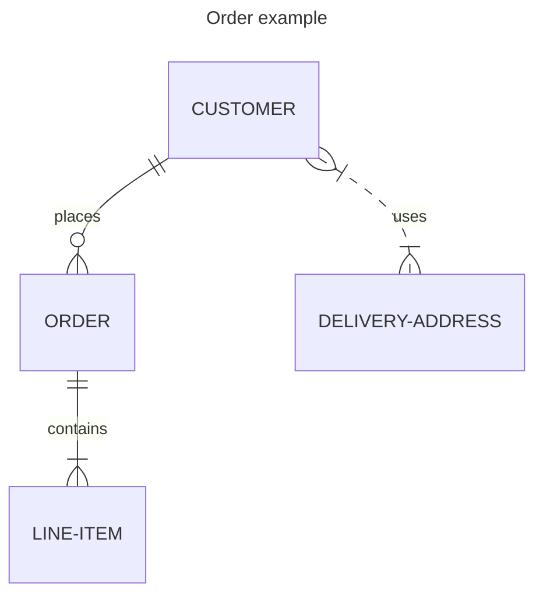

# HSM Emulator:

The `hsm-emulator` is a lightweight emulator that simulates the behavior of a Hardware Security Module (HSM) for
development and testing purposes.

## Overview

The HSM Emulator provides cryptographic operations such as key management between card and processor parties, enabling
developers to validate HSM-integrated workflows without requiring access to a physical HSM.

## Parties

The parties involved in the HSM emulator include:

- **ILF** - The ILF will be the activing ASE (Accont Serving Entity)
- **KaiOS** - The POS manufacturer
- **Austria Card** - The card issuer

## Build HSM Emulator:

The project is built as part of the Rafiki project.

## Start HSM Emulator

```shell
# Run (port 5002 default):
pnpm dev
```

## wdsd


