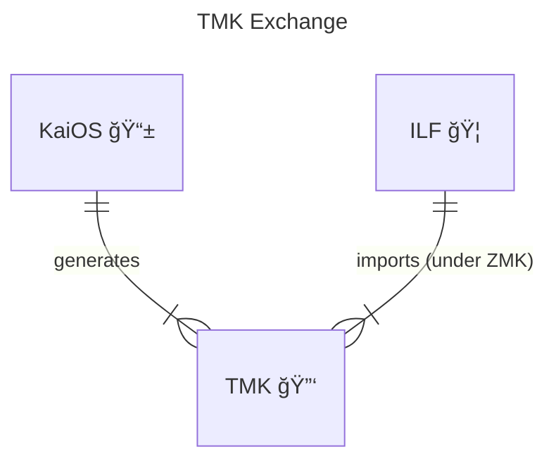

# HSM Emulator:
The `hsm-emulator` is a lightweight emulator that simulates the behavior of a Hardware Security Module (HSM) for
development and testing purposes.

## Overview
The HSM Emulator provides cryptographic operations such as key management between card and processor parties, enabling
developers to validate HSM-integrated workflows without requiring access to a physical HSM.

## Parties
The parties involved in the HSM emulator include:
- **ILF** - The ILF will be the activing ASE (Accont Serving Entity)
- **KaiOS** - The POS manufacturer
- **Austria Card** - The card issuer

## Build HSM Emulator:
The project is built as part of the Rafiki project.

## Start HSM Emulator
```shell
# Run (port 5002 default):
pnpm dev
```

## Key Management between Parties
The steps and digrams below illustrate the cryptographic keys and their relationship with one another and parties.

### 1. ZMK - Zone Master Key
The ZMK may be generated by either of two or more parties. One party is responsible for a ZMK key generation, while the 
other party is responsible for importing the ZMK. It is strongly advised that the ZMK be generated/imported using an HSM.
The KCV is used to verify integrity during the exchange. 


### 2. TMK - Terminal Master Key
The TMK is generated by the POS/terminal manufacturer. The TMK is securely transferred to the ASE, encrypted under the ZMK as TR-31 key-blocks.



### 3. Card Key - Card Asymmetric Private Key


## Terms
Terms of definition related to ASE, Card issuer and terminal manufacturers.

| Term  | Description                                                                                                                                                                                                                            |
|-------|----------------------------------------------------------------------------------------------------------------------------------------------------------------------------------------------------------------------------------------|
| HSM   | Hardware Security Module. Physical device that provides secure key storage and cryptographic processing. It is designed to protect sensitive data and perform secure operations.                                                       |
| LMK   | Local Master Key. Top-level encryption key used to secure and manage other keys within the HSM. It plays a central role in the HSM’s key hierarchy.                                                                                    |
| ZMK   | Zone Master Key. Cryptographic key used to securely exchange other encryption keys between two systems or organizations — typically between two HSMs (Hardware Security Modules) that are part of different cryptographic zones.       |
| TMK   | Terminal Master Key. Used to secure the transmission of working keys (like PIN, SRED encryption keys or MAC keys) between a terminal and the HSM.                                                                                      |
| KCV   | Key Check Value. Short cryptographic value derived from a key, used to verify that the key has been correctly transferred or entered without revealing the key itself.                                                                 |
| POS   | Point of Service device (also referred to as the terminal).                                                                                                                                                                            |
| TR-31 | A TR-31 key block is a standardized format used to securely exchange cryptographic keys between systems, especially in financial environments involving HSMs (Hardware Security Modules). It was defined by the ANSI X9.24-1 standard. |

