# HSM Emulator

The `hsm-emulator` is a lightweight emulator that simulates the behavior of a Hardware Security Module (HSM) for
development and testing purposes.

Please see: https://docs.google.com/document/d/12GGzU-HC9xAccj9t7EzLkrPEaSGZWCtMhGpjcwWBmG8/edit?tab=t.0

## Overview

The HSM Emulator provides cryptographic operations such as key management between card and processor parties, enabling
developers to validate HSM-integrated workflows without requiring access to a physical HSM.

## Parties

The parties involved in the HSM emulator include:

- **Customer ASE** - The Account Servicing Entity (ASE) who manages the card for the customer (issuer)
- **Merchant ASE** - The ASE who manages the POS device (acquirer)
- **KaiOS** - The POS manufacturer
- **Austria Card** - The card personalization / printer

## Build HSM Emulator:

The project is built as part of the Rafiki project.

## Start HSM Emulator

```shell
# Run (port 5002 default):
pnpm dev
```

## Key Management between Parties

The steps and digrams below illustrate the cryptographic keys and their relationship with one another and parties.

### 1.1. ZMK - Zone Master Key

The ZMK may be generated by either of two or more parties. One party is responsible for a ZMK key generation, while the
other party is responsible for importing the ZMK. It is strongly advised that the ZMK be generated/imported using an HSM.
The KCV is used to verify integrity during the exchange.

### 1.1.1 ZMK - Customer ASE (Issuer)

The ZMK generated between Customer ASE and Austria Card.

```mermaid
---
title: ZMK Exchange - Card
---
erDiagram
    "Customer ASE 🏦" ||--}| "ZMK 🔑" : "generates key"
    "Austria Card 💳" ||--|| "ZMK 🔑" : "imports key (3x clear components)"
```



### 1.1.2 ZMK - Merchant ASE (Acquirer)

The ZMK generated between Merchant ASE and KaiOS.

```mermaid
---
title: ZMK Exchange - POS
---
erDiagram
    "Merchant ASE 🏦" ||--}| "ZMK 🔑" : "generates key"
    "KaiOS 📱" ||--|| "ZMK 🔑" : "imports key (3x clear components)"
```



### 1.2. TMK - Terminal Master Key

The Terminal Master Key (TMK) is generated by the terminal POS manufacturer and is unique to each terminal.
The TMK is securely transferred to the Merchant ASE encrypted under the Zone Master Key (ZMK) using the TR-31 key block format.
The TMK facilitates the secure delivery of session keys between the ASE and the terminal,
ensuring encrypted communication and key management.

```mermaid
---
title: TMK Exchange
---
erDiagram
    "KaiOS 📱" ||--}| "TMK 🔑" : generates
    "Merchant ASE 🏦" ||--}| "TMK 🔑" : "imports (under ZMK)"
```



### 1.3. PIN/SRED BDK and IPEK - Base Derivation Key and Initial PIN Encryption Keys

The Base Derivation Keys (BDKs), generated by the Merchant’s ASE, are typically fixed per terminal manufacturer and model.
From each BDK, Initial PIN Encryption Keys (IPEKs) are derived and securely loaded onto the terminal.
These IPEKs are encrypted under the Terminal Master Key (TMK) using the TR-31 key block format, ensuring secure key delivery.
The distribution can occur either through direct injection or remotely via an over-the-air Remote Key Injection (RKI) process.

The PIN and SRED IPEK's will not share a BDK (See PCI-PIN Security Requirement ref #18-3).

```mermaid
---
title: PIN/SRED Key Exchange and IPEK
---
erDiagram
    "Merchant ASE 🏦" ||--|| "SRED / PIN BDK 🔑" : "generates"
    "SRED / PIN BDK 🔑" ||--}| "IPEK 🔑" : "generates derived IPEK (based on BDK)"
    "Terminal 📱" ||--|| "IPEK 🔑" : "imports (under TMK)"
```



### 2.1 Card Key - Card Asymmetric Keys

The Card Key Pair is generated by the Account Serving Entity (ASE), which also acts as the issuer.
A unique key pair is created for each card.
The public key from this pair is securely linked to a corresponding wallet address.

```mermaid
---
title: Card Key Generation and Issuing
---
erDiagram
    "Customer ASE 🏦" ||--}| "Card KeyPair 🔐" : "generates"
    "Card KeyPair 🔐" ||--}| "Private Key 🔑" : "has"
    "Card KeyPair 🔐" ||--}| "Public Key 🔓" : "has"
    "Public Key 🔓" |{--}| "Wallet Address 📇" : "store against wallet address 💽"

    "Austria Card 💳" ||--}| "Private Key 🔑" : "imports (under ZMK)"

    "Private Key 🔑" ||--|| "Card 💳" : "loaded onto (securely during issuing)"
```



### 2.2 POS Key - POS Asymmetric Keys

The POS Key Pair is generated by the merchant Account Serving Entity (ASE), which acts as the card acceptor / merchant.
A unique key pair is created for each POS terminal. The generation would take place when the POS terminal is linked to the merchant ASE.
The public key from this pair is securely linked to a corresponding merchant wallet address.

```mermaid
---
title: POS Key Generation and Registration
---
erDiagram
    "Merchant ASE 🏦" ||--}| "POS KeyPair 🔐" : "generates"
    "POS KeyPair 🔐" ||--}| "Private Key 🔑" : "has"
    "POS KeyPair 🔐" ||--}| "Public Key 🔓" : "has"
    "Public Key 🔓" |{--}| "Merchant Wallet Address DB 📇" : "store against merchant wallet address 💽"

    "Terminal 📱" ||--}| "Private Key 🔑" : "imports (under TMK)"

    "Private Key 🔑" ||--|| "Terminal 📱" : "loaded onto (securely during registration)"
```



## Glossary of Terms

Terms of definition related to ASE, Card issuer and terminal manufacturers.

| Term        | Description                                                                                                                                                                                                                                                                                                             |
| ----------- | ----------------------------------------------------------------------------------------------------------------------------------------------------------------------------------------------------------------------------------------------------------------------------------------------------------------------- |
| HSM         | Hardware Security Module. Physical device that provides secure key storage and cryptographic processing. It is designed to protect sensitive data and perform secure operations.                                                                                                                                        |
| LMK         | Local Master Key. Top-level encryption key used to secure and manage other keys within the HSM. It plays a central role in the HSM’s key hierarchy.                                                                                                                                                                     |
| ZMK         | Zone Master Key. Cryptographic key used to securely exchange other encryption keys between two systems or organizations — typically between two HSMs (Hardware Security Modules) that are part of different cryptographic zones.                                                                                        |
| TMK         | Terminal Master Key. Used to secure the transmission of working keys (like PIN, SRED encryption keys or MAC keys) between a terminal and the HSM.                                                                                                                                                                       |
| BDK         | Base Derivation Key, is the root key from which a unique IPEK (Initial PIN Encryption Key) is derived for each device or terminal. The IPEK, in turn, is used to derive session keys for each transaction, ensuring that no two transactions share the same encryption key.                                             |
| IPEK        | Initial PIN Encryption Key, is used to derive session keys for each transaction, ensuring that no two transactions share the same encryption key.                                                                                                                                                                       |
| KSN         | Key Serial Number. A unique identifier for each device, used in key derivation.                                                                                                                                                                                                                                         |
| Session Key | Derived from the IPEK for encrypting a single transaction.                                                                                                                                                                                                                                                              |
| DUKPT       | DUKPT stands for Derived Unique Key Per Transaction. It’s a key management scheme used primarily in payment systems (e.g. POS terminals) to ensure each transaction is encrypted with a unique key, dramatically reducing the risk of compromise.                                                                       |
| KCV         | Key Check Value. Short cryptographic value derived from a key, used to verify that the key has been correctly transferred or entered without revealing the key itself.                                                                                                                                                  |
| POS         | Point of Service device (also referred to as the terminal).                                                                                                                                                                                                                                                             |
| TR-31       | A TR-31 key block is a standardized format used to securely exchange cryptographic keys between systems, especially in financial environments involving HSMs (Hardware Security Modules). It was defined by the ANSI X9.24-1 standard.                                                                                  |
| PGP         | Pretty Good Privacy (PGP) is an encryption program that provides cryptographic privacy and authentication for data communication, primarily used for securing emails and files. It combines public-key and symmetric-key cryptography to ensure that messages remain confidential and can be verified for authenticity. |
